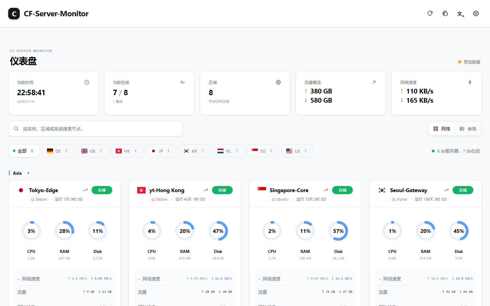
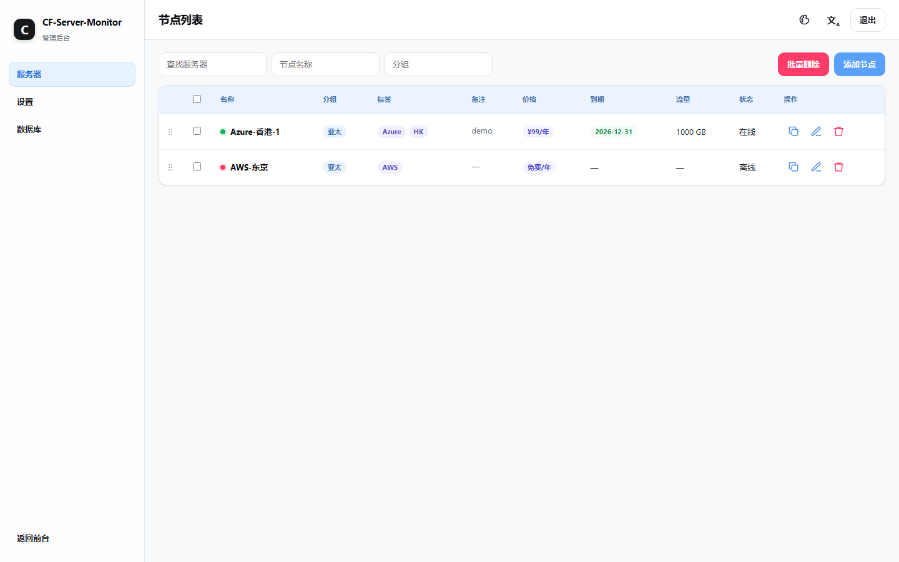

# CSM-Next

CSM-Next 是为 [CF-Server-Monitor](https://github.com/huilang-me/CF-Server-Monitor) 编写的一套独立前端。

UI 仿照 [komari-next](https://github.com/tonyliuzj/komari-next) 制作，数据接口仍使用 CF-Server-Monitor。项目不修改 Worker，也不依赖原面板的页面文件，构建后可以直接放到 Cloudflare Pages 或其他静态托管平台。

仓库已经配置好 Cloudflare Workers Builds。把仓库交给 Cloudflare 后，每次推送都会自动部署，不需要 GitHub Actions，也不需要手动上传 `dist/`。

## 界面预览

**首页**（`?preview=1` 模拟数据）



<details>
<summary><strong>实验性主题后台</strong>（点击展开，生产环境默认关闭）</summary>

<br>

> 实验性功能，默认不会启用。



</details>

## 目前支持

- 首页统计、区域筛选、搜索、网格和表格视图
- CPU、内存、磁盘、网络和流量信息
- 节点详情页与历史负载图表
- 四线路 Ping、丢包、波动和鼠标悬浮数据
- WebSocket 实时更新，断线后自动重连
- 多个 Worker 数据合并
- 中文、英文、明暗主题和移动端布局
- Cloudflare Turnstile
- 独立登录授权，可查看非公开站点、隐藏节点和长历史
- 可选实验性主题后台（节点管理、设置、数据库维护，默认关闭）

## 本地运行

需要 Node.js 18 或更高版本。下载源码后先安装 Wrangler：

```powershell
npm install
```

先复制一份本地配置：

```powershell
Copy-Item .\config\config.example.json .\config\config.local.json
```

然后修改 `config/config.local.json`：

```json
{
  "apiBase": [
    "https://your-worker.example.workers.dev"
  ],
  "title": "My Server Monitor",
  "backgroundImage": "",
  "refreshInterval": 60000,
  "customAdminEnabled": false
}
```

`apiBase` 可以填写多个 Worker 地址。`config.local.json` 已加入 `.gitignore`，不会随代码提交。

启动本地页面：

```powershell
npm run dev
```

- 模拟数据：`http://127.0.0.1:4173/?preview=1`
- 真实数据：`http://127.0.0.1:4173/`

如果真实数据请求被浏览器拦截，需要把 `http://127.0.0.1:4173` 加入 Worker 的 `CORS_ALLOWED_ORIGINS`。

## Cloudflare Worker 自动部署

1. 把 `CSM-Next` 推送到 GitHub 或 GitLab。
2. 在 Cloudflare 的 **Workers & Pages** 中选择 **Create application** → **Import a repository**。
3. 选择仓库，Worker 名称使用 `csm-next`。
4. 构建命令留空，部署命令保持默认的 `npx wrangler deploy`。
5. 保存并部署。

### Cloudflare Worker 配置

1. 进入 **Settings** → **Variables and Secrets**。
2. 选择 **Add**。
3. 类型选择普通文本变量。
4. 变量名填写 `CSM_API_BASE`。
5. 值填写自己的 CF-Server-Monitor Worker 地址，例如 `https://your-monitor.example.workers.dev`。
6. 选择 **Deploy** 使变量生效。

主题默认把“管理后台”链接到原 CF-Server-Monitor 的 `/#/admin`。如需启用 CSM-Next 自带的实验性后台，再添加普通文本变量：

```text
CSM_CUSTOM_ADMIN_ENABLED=true
```

未配置或填写 `false` 时，`/admin` 与 `/admin.html` 也会重定向到原站后台。登录授权查看私有内容不受此开关影响。

## 测试与构建

```powershell
npm test
npm run build
```

构建结果会写入 `dist/`：

```text
dist/
├─ index.html
├─ detail.html
├─ admin.html
├─ config.json
└─ assets/
```

`dist/` 用于发布压缩包、Cloudflare Pages 或其他普通静态托管；Cloudflare Worker 的 Git 部署不使用它。

## 目录

```text
CSM-Next/
├─ src/                    # 页面、脚本和样式
├─ worker/                 # Cloudflare Worker 入口
├─ config/                 # 配置模板与本地配置
├─ tests/                  # 冒烟测试
├─ scripts/                # 构建和本地静态服务器
├─ docs/                   # 开发、架构和部署说明
├─ wrangler.jsonc          # Worker 名称、资源和运行时配置
└─ package.json
```

需要修改页面时，可以先看 [开发说明](./docs/DEVELOPMENT.md) 和 [目录职责](./docs/ARCHITECTURE.md)。

## 使用说明

- 首页的线路延迟和丢包来自最近一次采样，不是 24 小时平均值。
- 首页和详情页默认读取公开内容；非公开站点、隐藏节点与更长历史可在主题内登录后查看。
- “管理后台”默认打开当前 CF-Server-Monitor Worker 的原生 `/#/admin`。
- 设置 `customAdminEnabled: true`（普通静态托管）或 `CSM_CUSTOM_ADMIN_ENABLED=true`（Cloudflare Worker）后，才启用主题自建 `admin.html`。
- CSM-Next 只保存上游签发的站点隔离 JWT，不保存管理密码或 Secret。

## 相关项目

- 后端：[CF-Server-Monitor](https://github.com/huilang-me/CF-Server-Monitor)
- UI 参考：[komari-next](https://github.com/tonyliuzj/komari-next)
- 国旗图标：[flag-icons](https://github.com/lipis/flag-icons)

CSM-Next 是独立的社区项目，与上述项目维护者没有官方隶属关系。

## License

[MIT](./LICENSE)
